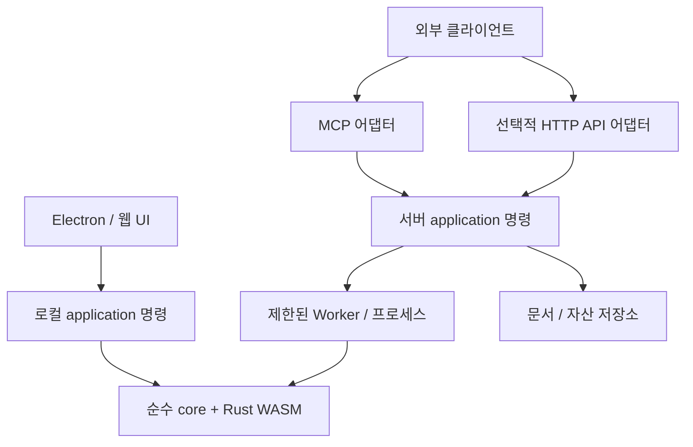

# 보완 우선순위와 웹·외부 MCP 확장 계획

## 구현 현황 (v1.1.0, 2026-09-22)

현재 동작은 [웹·MCP 가이드](../guides/web-mcp.md), 구조는 [ADR-0005](../adr/0005-application-layer.md)가 기준이다. 아래 본문은 설계 당시 제안이며 달라진 점만 여기 적는다.

- [x] 1단계 일부: Worker 작업별 취소·기한(`util/workerClient.ts`), 이력 바이트 예산(`core/doc/history.ts`, 환경 설정 "실행 취소 메모리"). Windows 실사용 측정은 사용자 확인 대기.
- [x] 2단계: `src/application` 명령 계층, 편집기의 탭·revision 커밋(`commandBridge.ts`). 이미지 크기·이름 바꾸기를 명령으로 전환.
- [x] 3단계: 웹 빌드·브라우저 어댑터·브라우저 E2E 15건.
- [x] 4단계: headless 서버(PNG import → resize/crop/레이어/필터 → PNG·.shcomp export), 메모리 저장소, worker_threads.
- [x] 5단계 MVP: MCP 16도구(stdio·Streamable HTTP), 정적 Bearer 토큰, 버전 충돌·operationId·job·자산 링크, SDK 클라이언트 E2E 15건.
- [ ] 6단계 라이브 탭 연결, OAuth 인가 서버 연동, 영속 저장소·다중 인스턴스, 서버 PSD·문자·AI, 실제 AI 클라이언트 연결 확인 — todo P2.
- 달라진 점: MCP 프로토콜은 SDK 1.30.0이 지원하는 **2025-11-25**로 고정했다 (본문의 2026-07-28 명세는 이 SDK에 없다). 도구에 실행 취소·다시 실행·삭제·base64 업로드(stdio용·작은 한도)를 더했다.

사용자가 요청한 후속 설계안이다. 현재 구현은 [검수 가이드](../guides/code-review.md)가 기준이다. 아래 모듈·도구·계약은 별도 표시가 없으면 **미구현 제안**이다. 기존 [brief](../brief.md)의 Windows 오프라인 편집기를 유지하면서 웹·외부 자동화로 확장한다. 계정·클라우드 저장·협업 전체를 이번 요청으로 구현하거나 배포하지 않는다. 구조를 채택하는 시점에 ADR을 작성한다.

## 1. 미흡한 점과 보완 순서

확인한 구조적 한계와 측정이 필요한 후보를 구분한다. 이전 검수가 끝났다는 것은 모든 입력·운영 환경에서 문제가 없다는 뜻이 아니다.

| 우선순위 | 근거와 남은 과제 | 권장 작업·완료 기준 |
|---|---|---|
| 먼저 | 실제 Windows 설치본 체감·파일 잠금 미검증 | 큰 사진에서 붓·탭 전환 중 저장·덮어쓰기·복구를 확인하고 재현 조건 기록 |
| 먼저 | `src/core/doc/history.ts`는 80단계 제한이며 바이트 예산 없음 | 공유 비트맵을 중복 계산하지 않는 메모리 집계, 문서/전체 예산과 오래된 이력 제거 정책 설계. 큰 문서 반복 편집 시 상한·undo 동작 검증 |
| 먼저 | `src/renderer/src/util/workerClient.ts`에 작업별 취소·시간 제한 없음 | AbortSignal·기한·종료 정리 추가. 취소·Worker 충돌·탭 닫기 뒤 pending과 자원 누수 없음. 공유 인코딩은 한 소비자 취소로 다른 소비자를 중단하지 않음 |
| 측정 후 | `src/renderer/src/editor/pixels.ts`의 bakeLayer, 획 시작 복사, 초대형 리터칭 동기 계산 | 2K/4K/8K·붓 크기별 입력→표시 p50/p95, 획 시작/계산/업로드 시간, 최대 메모리 기록. 영역 확장·타일·Worker를 비교한 뒤 선택 |
| 측정 후 | `src/renderer/src/editor/io.ts`의 대형 열기·PNG 내보내기, `editor/pack.ts`의 Worker 입력 복사 | decode/clone/compute/encode/I/O 분리 측정. Worker 이동 시 입력 버퍼 소유권과 오류·취소 계약 검증 |
| 측정 후 | `src/renderer/src/gl/GLRenderer.ts` CPU 폴백 합성, CPU 스포이트 합성 | 전체 재합성 횟수 측정 후 영역 계산 또는 버전별 캐시. 캐시 메모리 상한과 편집 후 무효화 검증 |
| 웹·MCP 선행 | `src/renderer/src/editor/store.ts`, `actions.ts`, `io.ts`가 UI·활성 탭·실행 로직을 함께 사용 | UI와 독립된 명령 계약을 작은 기능부터 추출. 문서 ID로 호출하고 늦게 끝난 결과가 새 편집을 덮지 않음 |
| 필요 시 | `src/renderer/src/components/DialogHost.tsx`, `ToolHeader.tsx`의 여러 책임, 자매 앱 복사 모듈 | 기능 변경 시 관련 책임만 분리. 복사 모듈은 소유 저장소·동기화 방식 결정. 파일 길이나 미사용 검사만으로 삭제 판단하지 않음 |

추가 제품 과제는 todo의 PSD 문자·벡터 마스크·고급 개체, SAM 품질/초기 추론 항목을 따른다. 웹 이전과 동시에 모두 해결할 필요는 없다.

`src/main/files.ts`의 임시 파일→rename 저장은 기존 파일 보호를 개선했지만 정전 시 fsync 내구성이나 복구 파일·메타데이터 두 파일의 트랜잭션을 보장하지 않는다. 필요성이 확인되면 세대별 저장+완료 표식 등의 별도 설계를 검증한다.

## 2. 웹과 MCP의 실행 위치부터 구분

Rust는 현재 `wasm32-unknown-unknown` WASM이므로 브라우저에서도 재사용할 수 있다. TypeScript 전체를 Rust로 옮기지 않는다. CPU 계산·복사 병목이 입증된 커널만 검토한다. WASM 인스턴스의 가변 작업 메모리는 동시 작업끼리 공유하지 않거나 직렬화한다.

| 사용 방식 | 문서의 권위 있는 상태 | 실행 위치·제약 |
|---|---|---|
| 웹 로컬 편집기 | 브라우저 문서 저장소 | 정적 웹 호스팅 가능. 브라우저에서 파일·WASM·Worker 처리. 탭이 닫히면 외부 호출을 받을 실행기가 없음 |
| 외부 MCP/API 편집 | 서버 문서 저장소 | 별도 서버·작업 실행기가 필요. 입력 업로드 후 브라우저 없이 실행하고 결과 내려받기 |
| 열려 있는 웹 탭 원격 조작 | 연결된 브라우저의 지정 문서 | 후속 선택 기능. 인증된 연결·페어링·사용자 허용 범위·문서 연결·단절/재연결 처리가 필요 |

권장 첫 범위는 로컬 웹 편집기와 독립적인 서버 문서 편집이다. 서버가 브라우저 로컬 파일을 자동으로 볼 수 있다고 가정하지 않는다. 서버 모드에서는 업로드·보관·삭제 정책을 UI에 명시한다. 동일 문서를 양쪽이 동시에 진실로 가지지 않으며, 가져오기/내보내기 또는 이후 명시적으로 설계한 동기화로 연결한다.



MCP가 반드시 HTTP API를 다시 호출할 필요는 없다. 두 어댑터가 같은 application 서비스를 호출한다. 웹 UI는 로컬 모드에서 서버를 거치지 않는다.

## 3. 공통 명령 계층과 플랫폼 경계

제안 위치 `src/application/`는 문서 명령·검증·이력·결과 계약을 담당한다. 제안 위치 `src/platform/` 또는 별도 패키지는 데스크톱/브라우저/서버 구현을 제공한다. 최종 폴더 구조는 첫 사례 구현 후 ADR에서 결정한다.

- application은 React, 전역 `editor`, `window.api`, 대화상자·toast를 import하지 않는다. 입력과 결과로 UI가 안내를 표시한다.
- DocumentRepository는 ID별 스냅샷 조회·버전 비교 커밋, AssetStore는 소유권 있는 입력/출력 바이트, JobRunner는 실행·취소·진행을 제공한다.
- 이미지 codec, 글꼴/문자 래스터화, 모델 URL/로딩은 런타임별 경계다. `src/renderer/src/editor/text.ts`의 Canvas·글꼴 결과가 서버에서 저절로 같아지지 않는다.
- Capability 목록으로 지원 작업·포맷을 노출한다. 서버 초기 범위는 PNG·래스터 문서 생성/크기 조절/내보내기부터 시작하고, PSD·문자·AI는 실제 런타임 검증 후 추가한다. 현재 PNG 디코더도 모든 PNG 변종을 지원한다고 가정하지 않는다.
- 포인터 UI는 문서 좌표의 의미 있는 편집 명령으로 변환한다. MCP에서 클릭을 흉내 내거나 붓 자국마다 네트워크 요청하지 않는다. 획 전체 좌표·압력·도구 설정을 제한된 배열로 받아 한 작업으로 처리한다.

웹 어댑터에는 파일 입력/다운로드(선택적으로 File System Access), Clipboard 권한 처리, IndexedDB/OPFS 복구·용량 초과 처리, 웹 닫기 안내가 필요하다. 창 버튼·실제 OS 경로·파일 연결은 웹 UX로 대체한다.
WASM·AI 모델의 정적 URL, 배포 base, MIME/CSP/CORS, 캐시 버전·오프라인 다운로드를 검증한다. WASM 스레드를 도입할 때만 필요한 격리 헤더·공유 메모리 요구를 별도로 검토한다. 현재 WASM 사용 자체에 스레드 구성을 강제하지 않는다.

## 4. 외부 명령 계약

모든 변경은 `docId`, `expectedRevision`, `operationId`를 명시한다. 사용자/조직 권한은 인증 정보에서 얻으며 호출자가 넣은 userId를 신뢰하지 않는다. 활성 탭을 기본 대상으로 사용하지 않는다.

아래는 **application 입력 예시**이며 MCP JSON-RPC 전체 메시지가 아니다.

```json
{
  "docId": "doc_123",
  "expectedRevision": 7,
  "operationId": "resize-unique-001",
  "width": 1920,
  "height": 1080,
  "resampling": "bilinear"
}
```

성공 결과는 `docId`, 새 `revision`, 변경 요약, 경고, 필요 시 `artifactId` 또는 `jobId`를 반환한다. 크기·좌표는 문서 픽셀/좌상단 원점으로 정의하고 회전·보간·색/알파 규약을 스키마에 적는다. 난수가 있는 기능은 seed를 기록한다.

문서별 변경 커밋은 직렬화한다. 긴 계산은 캡처한 버전으로 수행하되 커밋 시 버전을 다시 비교한다. 다른 편집이 앞서면 충돌로 종료하고 결과를 강제 덮어쓰지 않는다. 성공한 변경 하나를 undo 한 단계로 기록한다. 서버의 이력 보존 범위·기간은 별도 정책으로 정한다.

`operationId`는 소유 주체+문서+입력 지문과 묶어 실행 중/완료 결과를 보관한다. 동일 ID·동일 입력 재시도는 같은 작업/결과를 반환하고 다른 입력은 오류다. 보관 기한을 계약에 명시한다. 응답 단절이 커밋 취소를 뜻하지 않으므로 호출자는 상태 조회 후 재시도한다.

오류 코드는 최소 `INVALID_INPUT`, `NOT_FOUND`, `FORBIDDEN`, `REVISION_CONFLICT`, `RESOURCE_LIMIT`, `CANCELLED`, `TIMEOUT`, `UNSUPPORTED_CAPABILITY`를 구분한다. 내부 경로·토큰·stack을 외부 오류에 노출하지 않는다.

## 5. MCP 도구와 장시간 작업

첫 도구 집합 제안은 다음과 같다. UI 기능 수만큼 도구를 만들지 않는다.

| 도구 | 역할 |
|---|---|
| `compositor_document_create` | 크기가 제한된 빈 문서 생성 |
| `compositor_document_import` | 업로드된 assetId에서 문서 생성 |
| `compositor_document_get` | 버전·크기·기능 정보 조회 |
| `compositor_layer_list` / `compositor_layer_update` | ID별 레이어 조회·허용 속성 변경 |
| `compositor_image_resize` / `compositor_image_crop` | 명시적 크기·영역 편집 |
| `compositor_filter_apply` | 허용 필터 enum과 필터별 매개변수로 실행 |
| `compositor_export` | 지정 버전·포맷의 결과 자산 생성 |
| `compositor_job_get` / `compositor_job_cancel` | 작업 상태·취소 요청 |

각 도구는 JSON Schema로 필수 값·enum·수치·배열 상한과 결과를 정의한다. 읽기/변경 등의 annotations는 클라이언트 안내용이며 권한 검사를 대신하지 않는다. MCP 어댑터는 프로토콜 오류와 도구 실행 오류를 구분한다. [공식 tools 명세](https://modelcontextprotocol.io/specification/2026-07-28/server/tools)

이미지 원문을 거대한 base64 도구 인자/결과로 반복 전달하지 않는다. 제한된 별도 업로드 경로로 assetId를 발급하고 결과는 권한 확인 가능한 artifact 링크/리소스로 제공한다. 경로·임의 URL·shell 명령을 받지 않는다. URL 가져오기를 나중에 지원하면 별도 SSRF·리다이렉트·용량 검증이 필요하다.

장시간 연산은 application job을 반환한다. 상태는 queued/running/succeeded/failed/cancelled, 진행률은 단계와 처리량으로 표현한다. 취소는 커밋 전까지 적용 가능하며 이미 커밋된 작업은 완료 상태를 반환한다. CPU 계산을 async 함수로 감싸는 것만으로 서버 이벤트 루프가 분리되지 않는다. worker_threads 또는 프로세스로 격리하고 작업별 시간·메모리·동시 실행 상한을 둔다.

## 6. 프로토콜·인증·운영

원격 연결은 Streamable HTTP를 기준으로 검토하고 로컬 개발에는 stdio를 사용할 수 있다. 2026-07-28 명세와 실제 SDK·Claude 등 클라이언트 지원 버전은 다를 수 있다. 착수 시 양쪽이 지원하는 버전을 선택·고정하고 초기화/도구 발견/호출/취소를 실제 클라이언트로 검증한다. 오래된 SSE 서버 예제를 그대로 복사하지 않는다. 버전별 연결·취소 의미는 SDK와 해당 명세를 따른다. [공식 전송 명세](https://modelcontextprotocol.io/specification/2026-07-28/basic/transports/streamable-http)

application의 jobId는 MCP의 선택적 Tasks 확장과 별개다. 프로토콜 세션/연결을 문서 저장소나 사용자 권한의 수명으로 사용하지 않는다. 도구가 반환한 명시적 문서 ID의 수명·삭제·접근권을 애플리케이션에서 관리한다. 최신 명세 채택이 모든 클라이언트의 지원을 뜻하지 않는다. [공식 2026년 7월 변경 안내](https://blog.modelcontextprotocol.io/posts/2026-07-28/)

원격 인증은 선택한 MCP HTTP authorization 규약에 맞춘다. 토큰 발급자·대상 리소스·만료·scope를 검증하고 문서/자산/작업마다 소유권을 검사한다. 문서 ID를 안다는 것만으로 접근 권한이 생기지 않는다. 다른 서비스 토큰을 그대로 전달하지 않는다. CORS는 인증이 아니며 로컬 HTTP도 Origin 검증을 포함한다. [공식 authorization 명세](https://modelcontextprotocol.io/specification/2026-07-28/basic/authorization)

운영 시에는 압축 파일 크기뿐 아니라 디코딩 픽셀 수·레이어 수·총 바이트·작업 시간·이력·캐시·업로드/산출물 보관 기간을 제한한다. 숫자는 실제 메모리 측정과 예상 동시성으로 결정하고 설정값으로 관리한다. 중단된 업로드·작업·임시 파일의 만료 정리와 프로세스 장애 후 상태 복구를 검증한다.
로그에는 request/job/doc ID와 queue/clone/compute/encode 시간·오류 코드를 남기되 이미지 원문·인증 토큰을 남기지 않는다. 여러 사용자의 작업에 같은 가변 편집기/WASM scratch를 공유하지 않는다.

외부 배포 전에 [THIRD_PARTY_NOTICES](../../THIRD_PARTY_NOTICES.md)의 라이브러리·모델 라이선스를 배포 방식과 대조한다. 현재 목록에는 `@imgly/background-removal` AGPL-3.0도 있다. 원본 Compositor가 MIT라는 이유만으로 모든 의존성·모델에 같은 조건을 적용하지 않는다. 구체적 의무 판단은 별도 라이선스 검토 사항이다.

## 7. 단계별 작업과 완료 기준

각 단계는 작은 변경으로 진행한다. 코드 변경 시 기본 typecheck·단위·build, UI 변경 시 기존 Electron E2E 및 프로세스 종료 확인을 유지한다.

1. **기준 측정·안정성**: 실제 Windows 시나리오와 메모리/지연 측정, 재현되는 가장 큰 병목부터 처리. 이전 수치와 같은 조건으로 비교하고 취소·정리 회귀 검증.
2. **명령 계층 한 사례**: 레이어 속성 변경 또는 이미지 크기 변경을 UI 독립 입력→검증→새 Doc→이력 커밋으로 추출. UI와 직접 호출 결과가 같고 다른 문서를 건드리지 않음. 구조 채택 ADR 작성.
3. **웹 로컬 MVP**: 웹 전용 빌드·플랫폼 어댑터. Electron 없이 생성→열기→레이어 편집→리터칭→undo→저장/다시 열기·복구를 브라우저 E2E로 확인. WASM 로딩 실패 시 TS 폴백·저장소 용량 초과도 확인.
4. **서버 headless MVP**: 브라우저를 띄우지 않고 PNG import→resize→export 수행. 명시적 문서 저장소·Worker·자산 수명 도입. 지원하지 않는 포맷/기능은 명확하게 거절.
5. **원격 MCP MVP**: 인증·스키마·버전 충돌·중복 재시도·job·자산 링크를 연결. 실제 클라이언트 tools/list와 tools/call부터 결과 이미지 다운로드까지 E2E. 타 사용자 ID 접근, 과대 입력, 동시 편집, 응답 단절 후 재조회, 취소/장애 자원 정리 검증.
6. **선택적 라이브 탭 연결**: 필요가 확인되면 브라우저의 outbound 연결과 인증된 페어링 설계. 어느 탭/문서를 조작하는지 표시하고 오프라인·재접속·중복 전달·충돌 정책 구현. 독립 서버 MVP와 분리.

공통 픽셀 fixtures로 데스크톱·브라우저·서버 결과를 비교한다. 순수 CPU 경로는 기존 정확도 계약을 유지하고 리터칭 TS/WASM은 기존 테스트의 최대 1바이트 반올림 허용을 따른다. 글꼴·codec·GPU의 플랫폼 차이는 별도 허용 기준을 정하며 일괄 pixel-perfect를 약속하지 않는다.

착수 시 확정할 제품 선택은 서버 운영 위치, 개인용/다중 사용자 인증, 최대 문서 크기·동시성, 업로드 보관 기간, 라이브 탭 조작 필요 여부다. 기본 제안은 로컬 우선 웹, 서버 문서 별도 소유, 래스터 소수 도구, 제한된 작업 큐다. 이 문서는 특정 클라우드·유료 서비스·전면 협업 제품 도입을 확정하지 않는다.
